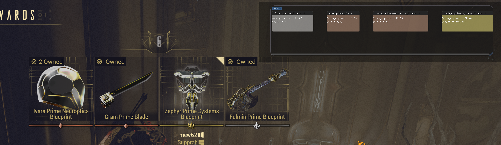
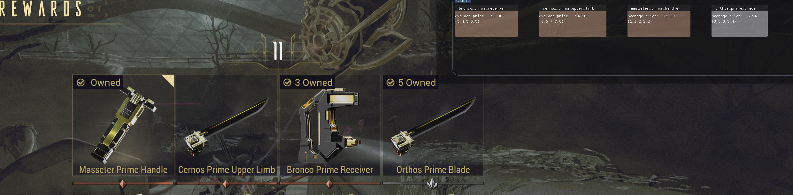
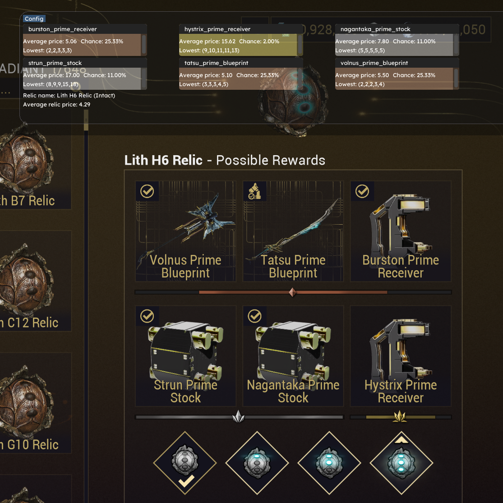
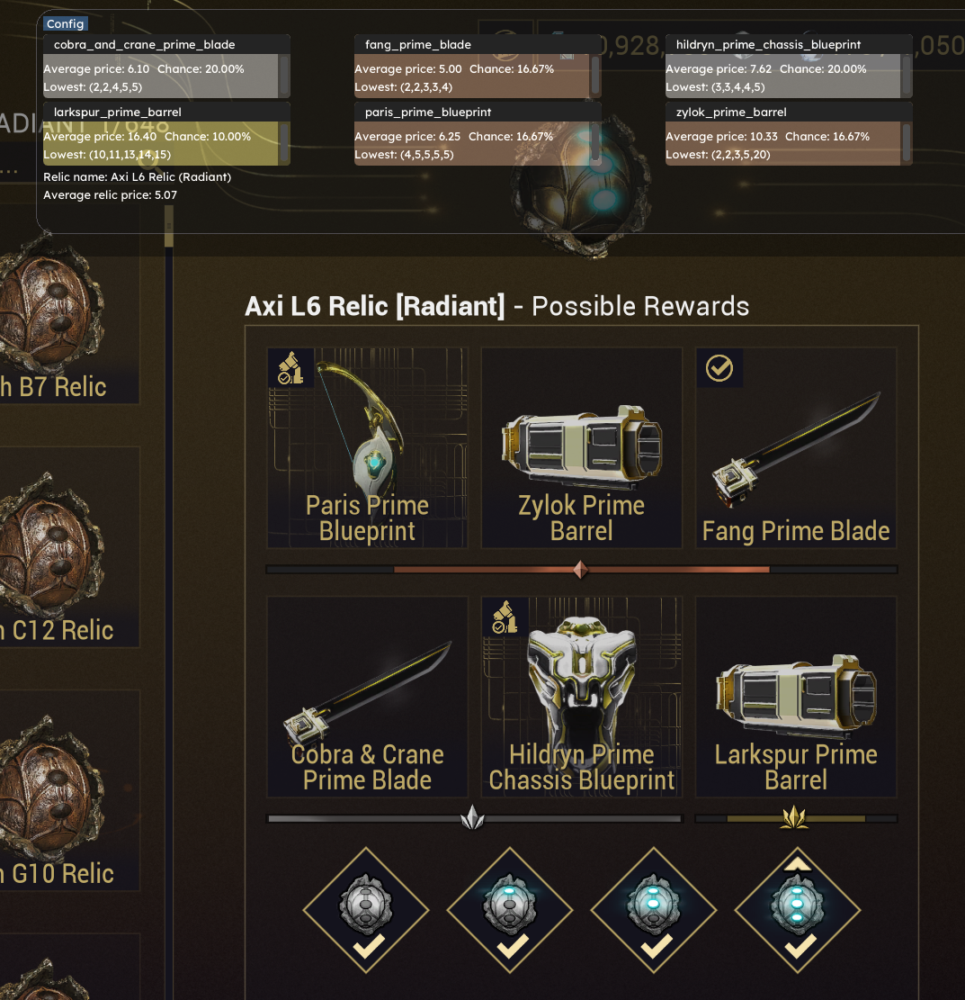

# Platinum-Eyes
Overlay app for Warframe. Provides a quick, realtime lookup of prices for the items you dropped from Warframe Market.

## ⭐Features
- [x] ***Fissure rewards***
 

&nbsp;
&nbsp;
&nbsp;
###
###
- [x] ***Relic possible rewards***

- [ ] Serial relic scanning

- [ ] Inventory scanning
- [ ] Warframe-Market integration

## ❗ Is it bannable?
All this app does, is something that you can do yourself, but much faster. You absolutely could search up in warframe market all the 4 items that you dropped in your fissure run, but why bother. Even if, the app takes screenshot of your screen which is completely not invasive. This app ***doesn't*** modify warframe files, so everything should be good. Remember though, it is still against Warframe TOS.

## ❓ How does it work?
Platinum Eyes can be split into 4 parts.
- ### 📸 Screenshot
     The app takes a screenshot of your display, in a specific place where item(or relic) names are.\
     It is platform specific, for windows it uses winapi, and for linux it will be using x11.
     
- ### 🏭 Ocr
     Image is then processed by ocr, to determine what words are in the picture. **There are 2 ocr's implemented in the app.** [More on that here](#ocr-selection).\
     They are also easily the heaviest part of the app, tesseract's training data alone is 20mb.
     
- ### 🚚 Fetch data
     After we get the data from image, for example an item name, we can query warframe-market for the avalible orders for that given item.\
     This is fairly well optimized.
     
- ### 🖥️ Display
     Lastly, we display the data that we recieve from warframe-market on the screen for a user.\
     **This app uses a weird mix of sfml and imgui.**

## 🖥️ Supported Resolutions
[Looking back here,](#-screenshot) it begs a question. How do we know WHERE to take a screenshot, or what to take a screenshot of? **Well, we can only guess.** Since resolutions vary, the places for where to take a screenshot also varies.\
How ui scaling in warframe works is currently beyond me. There is a formula that works in maybe 80% of the cases, so it is pretty fine for most resolutions, but not all. I can guarantee, that for those resolutions everything works well:
- 1920x1080
- 3440x1440
- 1366x768

But for the others, well u can just pray that it will work. Saying that, i am intending on bettering the formula so it works on all the resolutions. In the future there will be a way to tell the program where to take a screenshot, so that even if you have some very obscure resolutions, you will be able to set it up so it works just fine. So, if it doesn't work for your resolution, please open an issue and i will be more than happy to help.
  
## 💻 Supported Operating Systems

- ### 🟢 Windows
  It is primarly targeted for windows, everything will work fine here.

- ### 🟡 Linux
  I am intending on making this work on Linux too, using x11 instead of winapi. But that is in the future.
- ### 🔴 MacOs
  No.

## 📷 Ocr selection

App features 2 ocr's:

### Tesseract
This is the default one, and for most use cases this ocr is enough, and should do fine. No setup needed, just launch the app and everything works.\
Every new feature now strictly focuses on using tesseract.

### Easyocr
As i was starting with this app, i was using easyocr. It is a python package for ocr. Communication between python package and this c++ app was done by hosting a http server with python, and passing to it the path to the image that you want to process.\
I'm not sure why you would want to use it, since tesseract is much more well integrated into the current features, and there is less work to set it up. Just use tesseract.

## 🔧 How to build

Todo...

        
